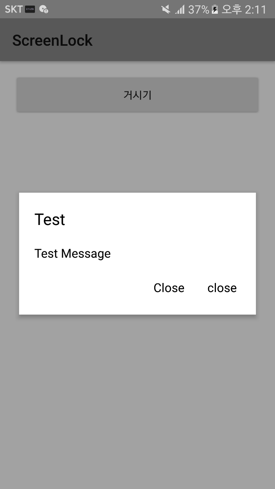

# FakeDialog
© 2021 Dark Tornado, All rights reserved.
* A view which looks like `AlertDialog` made with `WindowManager`.
* 다이얼로그 같이 생긴 `WindowManager`로 구현된 뷰.

## Why I made this. / 왜 만들엇는가?
* Dialog and `PopupWindow` cannot be used in `Service`.
* Therefore, I made it look like a dialog as much as possible by using `WindowManager`.
* Uploaded source is prototype.
  
* `Service`에서는 다이얼로그와 `PopupWindow`를 사용할 수 없어요.
* 따라서, `WindowManager`를 이용하여 최대한 다이얼로그처럼 보이게 만든거에요.
* 현재 올라와있는 소스는 프로토타입인거에요.

## License / 라이선스
* [MIT License](LICENSE)

## ScreenShot / 스크린샷

